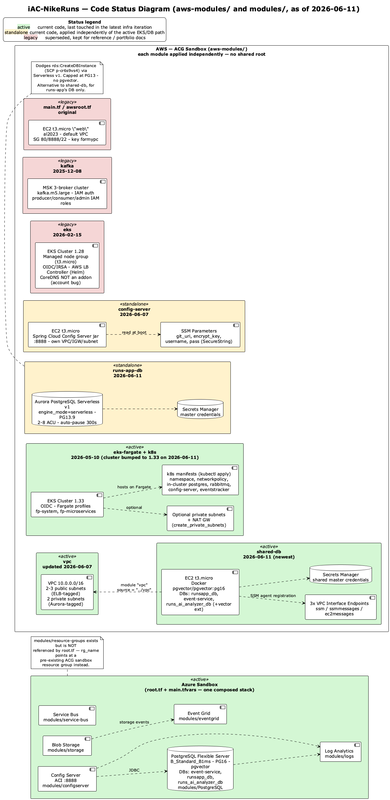

# iAC-NikeRuns — Dual-Cloud Infrastructure as Code

Terraform codebase that provisions infrastructure across **Azure** (sandbox) and **AWS** (ACG sandbox) to run the NikeRuns microservices ecosystem. Organized as composable Terraform modules — Azure is one composed stack (`root.tf`), AWS is a set of independently-applied modules under `aws-modules/`.

**Author:** Sathish Jayapal
**Last Updated:** June 2026

---

## Table of Contents

- [Architecture (Code Status Diagram)](#architecture-code-status-diagram)
- [Repository Structure](#repository-structure)
- [Azure Infrastructure](#azure-infrastructure)
- [AWS Infrastructure](#aws-infrastructure)
- [Quick Start](#quick-start)
- [Terraform Conventions](#terraform-conventions)
- [Key Architectural Decisions](#key-architectural-decisions)
- [Keeping This README Current](#keeping-this-readme-current)

---

## Architecture (Code Status Diagram)

The diagram below is a **code status diagram**, not a "what's currently deployed" diagram. AWS modules under `aws-modules/` are applied independently (there is no shared root module), so several modules co-exist as alternative or superseded approaches to the same problem (working around the ACG sandbox SCP `p-cr6s9vs4`, which denies `rds:CreateDBInstance`). Colors indicate status:

- 🟩 **active** — current code, part of the latest infra iteration
- 🟨 **standalone** — current code, but applied independently of the active EKS/DB path
- 🟥 **legacy** — superseded, kept for reference / portfolio docs



Source: [`docs/diagrams/architecture.puml`](docs/diagrams/architecture.puml). The PNG above is generated from this source — regenerate it after editing with:

```bash
java -jar plantuml.jar -tpng -o docs/diagrams docs/diagrams/architecture.puml
```

---

## Repository Structure

```
iAC-NikeRuns/
├── root.tf                    # Azure module declarations (one composed stack)
├── root-variables.tf          # Variable definitions for all Azure modules
├── main.tfvars                # Environment-specific values (ACG sandbox)
│
├── docs/
│   ├── adr/                   # Architecture Decision Records
│   └── diagrams/
│       └── architecture.puml  # PlantUML source for the diagram above
│
├── modules/                    # Azure modules
│   ├── configserver/           # ACI — Spring Cloud Config Server
│   ├── PostgreSQL/              # Flexible Server, B1ms, PG16+pgvector, 3 DBs
│   ├── storage/                # Blob Storage account + container
│   ├── logs/                   # Log Analytics workspace
│   ├── service-bus/            # Service Bus namespace + queue
│   ├── eventgrid/               # Event Grid namespace + system topic
│   └── resource-groups/        # Present but NOT referenced by root.tf
│
└── aws-modules/                # AWS modules — each applied independently
    ├── awsroot.tf, main.tf     # legacy: standalone EC2 "web" instance
    ├── scripts/user_data.sh
    │
    ├── vpc/                    # VPC, public + private subnets, control-plane SG
    │
    ├── shared-db/               # ACTIVE (newest): EC2 + Docker pgvector, all 3 DBs
    │   └── main.tf              # composes module "vpc" { source = "../vpc" }
    │
    ├── eks-fargate/             # ACTIVE: EKS 1.33, Fargate-only, OIDC
    ├── k8s/                     # ACTIVE: manifests deployed onto eks-fargate
    │   ├── 00-namespace.yaml ... 40-eventstracker.yaml
    │   └── README.md            # deploy runbook
    │
    ├── runs-app-db/             # standalone: Aurora PostgreSQL Serverless v1
    ├── config-server/           # standalone: EC2-hosted Spring Cloud Config Server
    │
    ├── eks/                     # legacy: EKS 1.28 managed node group + LBC
    └── kafka/                   # legacy: MSK 3-broker cluster + IAM roles
```

---

## Azure Infrastructure

`root.tf` + `main.tfvars` provision one composed stack in the ACG Azure sandbox:

| Module | Resource | Key Config |
|--------|----------|-----------|
| configserver | Container Instances (ACI) | 0.5–1 CPU, ~1.5–2 GB RAM, port 8888 |
| PostgreSQL | PostgreSQL Flexible Server | **B_Standard_B1ms**, **PostgreSQL 16**, `azure.extensions=VECTOR` (pgvector), public access + open firewall (dev-only) |
| PostgreSQL | 3 databases on the same server | `event-service` (eventstracker), `runsapp_db` (runs-app), `runs_ai_analyzer_db` (runs-ai-analyzer, pgvector) |
| storage | Blob Storage | StorageV2, container `storcont` |
| service-bus | Service Bus namespace + queue | Basic SKU, partitioned queue |
| eventgrid | Event Grid system topic | Standard, storage events |
| logs | Log Analytics workspace | `PerGB2018`, 30-day retention |

`root.tf` also exposes `pg_host`, `pg_port`, `pg_admin_user`, `pg_admin_password`, and per-app JDBC URL outputs (`jdbc_eventstracker`, `jdbc_runsapp`, `jdbc_runsai`) consumed by local dev scripts.

> `modules/resource-groups/` exists in the codebase but `root.tf` does not declare a `module "resourcegroupmodule"` block — `var.rg_name` points at a resource group the ACG sandbox already provides.

### Required `main.tfvars` Values

```hcl
tenant_id        = "<your-azure-tenant-id>"
subscription_id  = "<your-azure-subscription-id>"
rg_name          = "<your-acg-sandbox-resource-group>"
prefix           = "test"
environment      = "dev"
primary_location = "East US"
pg_admin_password = "<set via TF_VAR_pg_admin_password>"
```

---

## AWS Infrastructure

Every directory under `aws-modules/` is its own root module — `cd` into it and run `terraform init/plan/apply` independently. There is **no shared root** wiring these together.

| Module | Status | Provisions | Key Config |
|--------|--------|------------|-----------|
| `vpc` | 🟩 active | VPC, 2-3 public subnets, 2 private subnets, control-plane SG | CIDR `10.0.0.0/16`, ELB-tagged public subnets |
| `shared-db` | 🟩 active (newest) | EC2 t3.micro running Docker `pgvector/pgvector:pg16` hosting **all 3 app databases**, 3 VPC interface endpoints (ssm/ssmmessages/ec2messages), Secrets Manager secret | No SSH/key-pair — access only via SSM port-forwarding to `localhost:5432`. Composes `module "vpc" { source = "../vpc" }` |
| `eks-fargate` | 🟩 active | EKS 1.33 cluster (public+private API endpoints), OIDC provider, Fargate profiles `fp-system` + `fp-microservices`, optional private subnets + NAT GW | Fargate-only — no node groups, no LBC, no MSK/Aurora |
| `k8s` | 🟩 active | Manifests applied via `kubectl` onto `eks-fargate`: namespace, NetworkPolicy (intent-only on Fargate CNI), in-cluster Postgres, RabbitMQ, config-server, eventstracker | See `aws-modules/k8s/README.md` for the full deploy runbook |
| `runs-app-db` | 🟨 standalone | Aurora PostgreSQL **Serverless v1** cluster + Secrets Manager | `engine_mode = "serverless"`, PostgreSQL **13.9** (v1 max), 2–8 ACU, `auto_pause` after 300s. Dodges `rds:CreateDBInstance` SCP deny. No pgvector — alternative to `shared-db` for runs-app only |
| `config-server` | 🟨 standalone | EC2 t3.micro running the Spring Cloud Config Server jar directly, own VPC/subnet/IGW, SSM Parameter Store for secrets (`git_uri`, `encrypt_key`, `username`, `pass`), generated key pair | Port 8888; see `config-server-deploy` Claude skill (`deploy.sh`) |
| `eks` | 🟥 legacy | EKS 1.28 cluster, managed node group (t3.micro, min=1/desired=2/max=4), OIDC/IRSA, AWS Load Balancer Controller via Helm | CoreDNS intentionally **not** an EKS addon — see `COREDNS_ADDON_BUG.md`. Superseded by `eks-fargate` |
| `kafka` | 🟥 legacy | MSK 3-broker cluster (`kafka.m5.large`, 100 GB EBS), IAM auth, producer/consumer/admin IAM roles, `app-*` topic / `cg-*` consumer-group naming convention | Not used by the active Fargate path (`eks-fargate` explicitly excludes MSK) |
| `main.tf` / `awsroot.tf` | 🟥 legacy | One standalone EC2 t3.micro (`al2023-ami`) in the default VPC | SG opens 80, 8888, 22; key pair `formypc` |

---

## Quick Start

### Azure (Sandbox)

```bash
# From repo root
terraform init
terraform plan -var-file="main.tfvars"
terraform apply -var-file="main.tfvars"

# Tear down
terraform destroy -var-file="main.tfvars"
```

> **Reset state:** Delete `.terraform/` and `.terraform.lock.hcl` before `init` if the ACG sandbox subscription rotated.

### AWS — Active path: `vpc` → `shared-db` (databases) + `eks-fargate` + `k8s` (compute)

```bash
# 1. Networking + shared databases (pgvector-enabled, all 3 DBs)
cd aws-modules/shared-db
cp terraform.tfvars.example terraform.tfvars   # fill in from ACG "AWS Details"
terraform init && terraform plan && terraform apply

# Connect via SSM tunnel
aws ssm start-session --target $(terraform output -raw ssm_relay_instance_id) \
  --document-name AWS-StartPortForwardingSession \
  --parameters '{"portNumber":["5432"],"localPortNumber":["5432"]}'

# 2. EKS Fargate cluster
cd ../eks-fargate
cp terraform.tfvars.example terraform.tfvars   # set vpc_id, subnet_ids, create_private_subnets
terraform init && terraform apply
aws eks update-kubeconfig --region us-east-1 --name $(terraform output -raw cluster_name)

# 3. Deploy microservices onto Fargate — see full runbook:
cd ../k8s && cat README.md
```

### AWS — Standalone: Aurora PostgreSQL (`runs-app-db`)

```bash
cd aws-modules/runs-app-db
terraform init
terraform plan
terraform apply
```

### AWS — Standalone: EC2 Config Server

```bash
cd aws-modules/config-server
cp terraform.tfvars.example terraform.tfvars
terraform init && terraform apply
# or use the "config-server-deploy" Claude skill: ./deploy.sh
```

### AWS — Legacy: EKS (managed node group) / Kafka (MSK) / single EC2

```bash
cd aws-modules/eks    && terraform init && terraform plan && terraform apply
cd aws-modules/kafka  && terraform init && terraform plan && terraform apply
cd aws-modules        && terraform init && terraform plan && terraform apply   # main.tf "web" EC2
```

### AWS — EC2 (Key Pair — one-time setup, legacy `eks`/`main.tf` modules)

```bash
aws ec2 create-key-pair \
  --key-name formypc \
  --query 'KeyMaterial' \
  --output text > formypc.pem
chmod 700 formypc.pem
```

---

## Terraform Conventions

### Azure (composed stack via `root.tf`)

When adding a new resource or module:

1. **Create the module folder** under `modules/` with `main.tf` and `variables.tf`.
2. **`main.tf`** — resource definitions using module-scoped variables.
3. **`variables.tf`** — declare every variable the module needs.
4. **`root.tf`** — add the `module {}` block passing all required variables.
5. **`root-variables.tf`** — re-declare module variables at root scope.
6. **`main.tfvars`** — supply concrete values for all non-default variables.

### AWS (independent modules under `aws-modules/`)

Each directory under `aws-modules/` is a standalone root module with its own `terraform { required_providers {} }` and `provider "aws" {}` blocks — there is no parent module. New AWS infrastructure should follow the same pattern: own directory, own `main.tf`/`variables.tf`/`outputs.tf`, own `.gitignore` covering `.terraform/`, `*.tfstate*`, `*.tfvars`, and any generated artifacts (`*.zip`, `*.pem`). Cross-module composition (e.g. `shared-db` consuming `../vpc`) uses a relative `source` path.

---

## Key Architectural Decisions

| Decision | Choice | Why |
|----------|--------|-----|
| IaC tool | Terraform | Cloud-agnostic; state management; mature provider ecosystem for both Azure and AWS |
| Azure compute | Container Instances (ACI) | Lightest-weight option for a single stateless Spring Boot JAR; no K8s management overhead in sandbox |
| Azure database | PostgreSQL Flexible Server, Burstable B1ms, PG16 + pgvector | Cheapest SKU that still supports pgvector (>= PG13); hosts all 3 app databases on one server |
| AWS compute (active) | EKS Fargate (1.33) | No node groups / Auto Scaling Groups to manage; works inside ACG sandbox's existing VPC; minimal extra networking (opt-in private subnets + NAT) |
| AWS compute (legacy) | EKS 1.28 with managed node group + AWS LB Controller | Original full-orchestration approach; superseded once Fargate proved sufficient for configserver/eventstracker/rabbitmq |
| AWS database (active) | EC2 + Docker `pgvector/pgvector:pg16` (`shared-db`) | ACG SCP `p-cr6s9vs4` denies `rds:CreateDBInstance`, blocking **all** managed RDS options including Aurora Serverless v2. Docker on EC2 needs zero RDS API calls and supports pgvector for `runs_ai_analyzer_db` |
| AWS database (standalone alt.) | Aurora PostgreSQL Serverless v1 (`runs-app-db`) | `engine_mode = "serverless"` also avoids `rds:CreateDBInstance`, but caps at PG13 (no pgvector) — viable for runs-app alone |
| AWS access | SSM Session Manager (no SSH, no key pairs) for `shared-db` | VPC Interface Endpoints (ssm/ssmmessages/ec2messages) let the SSM agent register without internet egress, which ACG network policy may block |
| Kafka | MSK (managed), legacy module | Originally chosen to eliminate ZooKeeper/KRaft management with IAM auth; not part of the active Fargate path, which has no event-streaming requirement yet |
| Module structure | One module per resource type / concern | Independent plan/apply cycles; clear separation of concerns; AWS modules apply independently rather than via a shared root |

> Full architecture decision records: [`docs/adr/`](docs/adr/). Note that ADR-002 (EKS managed node group) and ADR-004 (Aurora Serverless v2) describe the **original** Feb-2026 decisions; the table above reflects what superseded them. New/updated ADRs for the Fargate and `shared-db` pivots have not been written yet.

---

## Keeping This README Current

A GitHub Actions workflow (`.github/workflows/readme-guard.yml`) fails CI if `.tf`, `.tfvars.example`, or `aws-modules/**/*.yaml` files change without a corresponding `README.md` update. When you add, replace, or retire a module:

1. Update the relevant table above (Azure or AWS Infrastructure) and the repository structure tree.
2. Update `docs/diagrams/architecture.puml` — add/move the module's package and adjust its status color (active / standalone / legacy).
3. Update `Quick Start` if the new module needs its own apply steps.