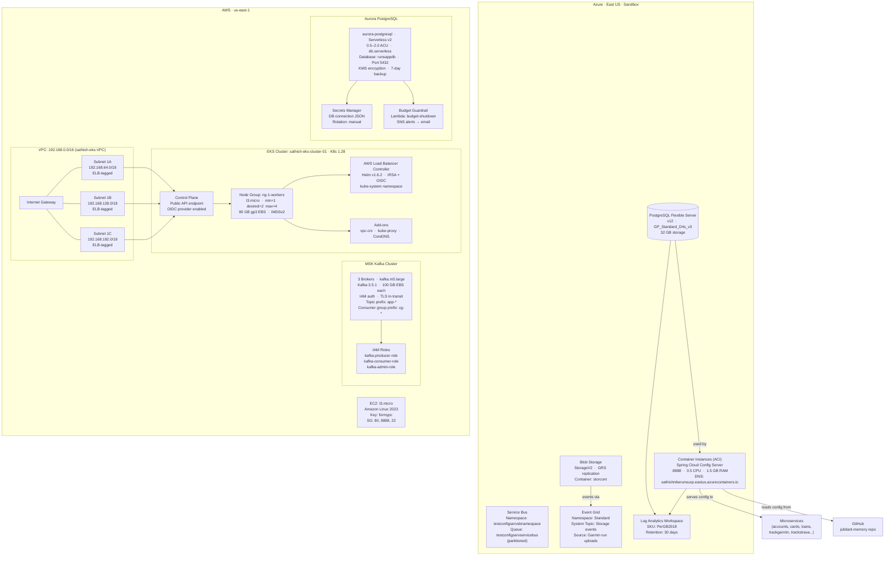
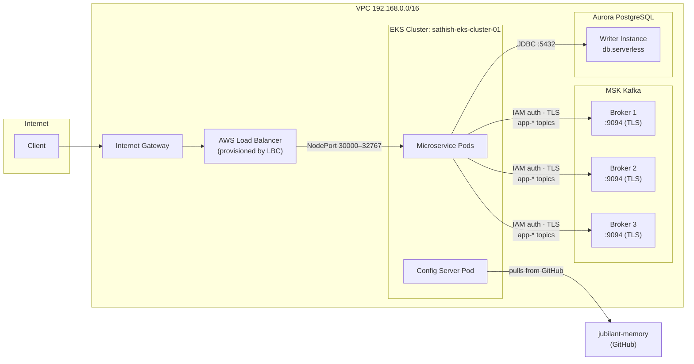

# iAC-NikeRuns — Dual-Cloud Infrastructure as Code

Terraform codebase that provisions infrastructure across **Azure** (sandbox) and **AWS** (EKS + MSK + Aurora) to run the NikeRuns microservices application. Organized as composable Terraform modules for repeatable, environment-driven deployments.

**Author:** Sathish Jayapal
**Last Updated:** February 2026

---

## Table of Contents

- [Architecture](#architecture)
- [Repository Structure](#repository-structure)
- [Azure Infrastructure](#azure-infrastructure)
- [AWS Infrastructure](#aws-infrastructure)
- [Quick Start](#quick-start)
- [Terraform Conventions](#terraform-conventions)
- [Key Architectural Decisions](#key-architectural-decisions)

---

## Architecture

### Dual-Cloud Overview



### AWS EKS + MSK Detailed Flow



---

## Repository Structure

```
iAC-NikeRuns/
├── root.tf                    # Azure module declarations
├── root-variables.tf          # Variable definitions (all Azure modules)
├── main.tfvars                # Environment-specific values
│
├── modules/                   # Azure modules
│   ├── configserver/          # ACI — Spring Cloud Config Server
│   │   └── main.tf
│   ├── PostgreSQL/            # Azure PostgreSQL Flexible Server
│   │   └── main.tf
│   ├── storage/               # Blob Storage account + container
│   │   └── main.tf
│   ├── logs/                  # Log Analytics workspace
│   │   └── log-analytics.tf
│   ├── service-bus/           # Service Bus namespace + queue
│   │   └── main.tf
│   └── eventgrid/             # Event Grid namespace + system topic
│       └── main.tf
│
└── aws-modules/               # AWS modules
    ├── awsroot.tf             # AWS provider configuration
    ├── main.tf                # EC2 instance
    ├── scripts/
    │   └── user_data.sh       # EC2 bootstrap script
    ├── vpc/
    │   └── vpc.tf             # VPC, 3 subnets, IGW, route table
    ├── eks/
    │   └── main.tf            # EKS cluster, node group, OIDC, LBC Helm
    ├── kafka/
    │   ├── main.tf            # MSK cluster + CloudWatch logging
    │   └── iam.tf             # Producer / consumer / admin IAM roles
    └── runs-app-db/
        └── main.tf            # Aurora PostgreSQL + Secrets Manager + Budget Lambda
```

---

## Azure Infrastructure

| Resource | Name Pattern | Key Config |
|----------|-------------|-----------|
| Container Instances | testconfigsrvrcontgrp | 0.5 CPU, 1.5 GB RAM, port 8888 |
| PostgreSQL Flexible | testsathish-main-grouppostgres | v12, GP_Standard_D4s_v3, 32 GB |
| Blob Storage | testconfigservstoraccnt | StorageV2, GRS |
| Service Bus | testconfigservsbnamespace | Basic SKU, partitioned queue |
| Event Grid | — | Standard, Storage system topic |
| Log Analytics | sathishnikerunserverlogs | PerGB2018, 30-day retention |

### Required `main.tfvars` Values

```hcl
tenant_id       = "<your-azure-tenant-id>"
subscription_id = "<your-azure-subscription-id>"
rg_name         = "<your-resource-group-name>"
prefix          = "test"
environment     = "dev"
primary_location = "East US"
```

---

## AWS Infrastructure

| Module | Resources | Key Config |
|--------|-----------|-----------|
| vpc | VPC, 3 subnets, IGW, route table | CIDR: 192.168.0.0/16, ELB-tagged subnets |
| eks | EKS cluster, node group, OIDC, LBC Helm | K8s 1.28, t3.micro, 2 desired nodes |
| kafka | MSK 3-broker cluster, IAM roles | kafka.m5.large, 100 GB EBS, IAM auth |
| runs-app-db | Aurora PostgreSQL, Secrets Manager, Budget Lambda | Serverless v2, 0.5–2.0 ACU, runsappdb |
| main (EC2) | EC2 instance | t3.micro, al2023-ami, ports 80/8888/22 |

### Kafka IAM Topic Naming Convention

All Kafka clients must follow IAM-enforced naming conventions:

| Resource | Required Prefix | Example |
|----------|----------------|---------|
| Topics | `app-` | `app-garmin-runs`, `app-strava-events` |
| Consumer Groups | `cg-` | `cg-runs-processor`, `cg-analytics` |

---

## Quick Start

### Azure (Sandbox)

```bash
# From repo root
terraform init
terraform plan -var-file="main.tfvars"
terraform apply -var-file="main.tfvars"

# Tear down
terraform destroy -var-file="main.tfvars"
```

> **Reset state:** Delete `.terraform/` and `.terraform.lock.hcl` before `init` if switching backends.

### AWS — EKS

```bash
cd aws-modules/eks
terraform init
terraform plan
terraform apply
```

### AWS — Kafka (MSK)

```bash
cd aws-modules/kafka
terraform init
terraform plan
terraform apply
```

### AWS — Aurora PostgreSQL

```bash
cd aws-modules/runs-app-db
terraform init
terraform plan
terraform apply
```

### AWS — EC2 (Key Pair — one-time setup)

```bash
aws ec2 create-key-pair \
  --key-name formypc1 \
  --query 'KeyMaterial' \
  --output text > formypc.pem
chmod 700 formypc.pem
```

---

## Terraform Conventions

When adding a new resource or module:

1. **Create the module folder** with `main.tf` and `variables.tf`.
2. **`main.tf`** — resource definitions using module-scoped variables.
3. **`variables.tf`** — declare every variable the module needs.
4. **`root.tf`** — add the `module {}` block passing all required variables.
5. **`root-variables.tf`** — re-declare module variables at root scope.
6. **`main.tfvars`** — supply concrete values for all non-default variables.

---

## Key Architectural Decisions

| Decision | Choice | Why |
|----------|--------|-----|
| IaC tool | Terraform | Cloud-agnostic; state management; mature provider ecosystem for both Azure and AWS |
| Azure compute | Container Instances (ACI) | Lightest-weight option for a single stateless Spring Boot JAR; no K8s management overhead in sandbox |
| AWS compute | EKS (Kubernetes 1.28) | Full orchestration for multi-service deployment; integrates with MSK, Aurora, and ALB via IRSA |
| Kafka | MSK (managed) | Eliminates ZooKeeper/KRaft cluster management; IAM auth removes credential management; CloudWatch log integration |
| Database | Aurora Serverless v2 | Auto-scales from 0.5 ACU to 2.0 ACU — cost-efficient for variable load; no idle cost at minimum ACU |
| Cost control | Lambda budget-shutdown | Automatic safeguard against runaway cloud costs in dev/sandbox environments |
| Module structure | One module per resource type | Independent plan/apply cycles; clear separation of concerns; reusable across environments |

> Full architecture decision records: [`docs/adr/`](docs/adr/)
